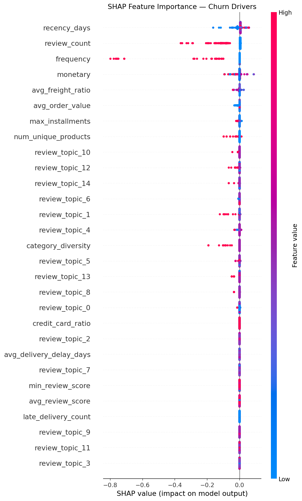
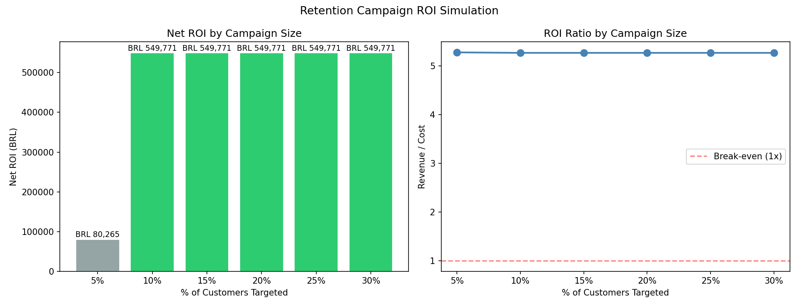
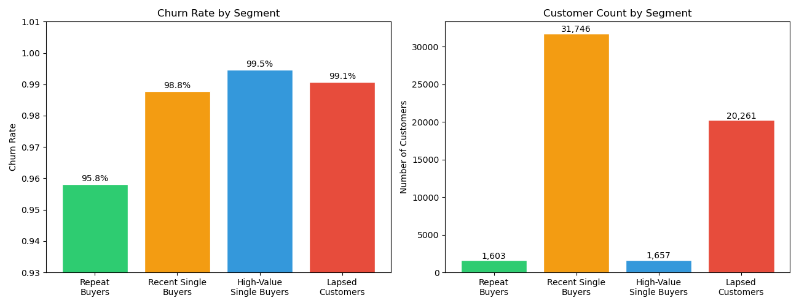

# Customer Churn Prediction & Retention ROI Simulation

**Tech Stack:** Python · SQL (SQLite) · XGBoost · SHAP · TF-IDF · Pandas · Matplotlib

## Business Problem
In a marketplace where **97% of customers are one-time buyers**, retaining even a
small fraction of at-risk customers represents significant recoverable revenue.
This project builds an end-to-end churn prediction system that identifies high-risk
customers and quantifies the ROI of a targeted retention campaign.

## Dataset
[Olist Brazilian E-Commerce Public Dataset](https://www.kaggle.com/datasets/olistbr/brazilian-ecommerce)
— 100K+ orders · 9 relational tables · 2016–2018

> Raw data not included. Download from Kaggle and place CSVs in `data/raw/`.

---

## Methodology

### 1. SQL Feature Engineering
Loaded all 9 tables into SQLite and used **CTEs + window functions** to build
a customer-level feature table (55,267 customers × 15 features):

| Feature Group | Features |
|--------------|---------|
| RFM | recency_days, frequency, monetary, avg_order_value |
| Review | avg_review_score, min_review_score, review_count |
| Product | num_unique_products, category_diversity, avg_freight_ratio |
| Payment | credit_card_ratio, max_installments |
| Delivery | avg_delivery_delay_days, late_delivery_count |
| Text (TF-IDF) | 15 SVD components from customer review messages |

### 2. Customer Segmentation
K-Means clustering on RFM scores identified 4 customer segments:

| Segment | Size | Churn Rate | Insight |
|---------|------|-----------|---------|
| Repeat Buyers | 1,603 | 96% | Only group with frequency > 1 |
| Recent Single Buyers | 31,746 | 99% | Retention window is now |
| High-Value Single Buyers | 1,657 | 99% | Avg spend BRL 1,056 — high CLV potential |
| Lapsed Customers | 20,261 | 99% | High recency, likely lost |

### 3. Churn Prediction Model
- **Model:** XGBoost with early stopping (best iteration = 10)
- **Text features:** TF-IDF (200 features) → TruncatedSVD (15 components) on review text
- **Imbalance handling:** scale_pos_weight on 98.8% churn rate
- **AUC-ROC:** 0.6117 on held-out 20% test set

### 4. SHAP Interpretability
Top churn drivers by mean |SHAP value|:

1. `recency_days` — most recent buyers are most likely to return
2. `review_count` — **engagement outpredicts satisfaction**: writing a review predicts return behavior more strongly than review score
3. `frequency`, `monetary` — higher engagement correlates with lower churn
4. `avg_freight_ratio` — high freight-to-price ratio signals price sensitivity

> **Key insight:** Whether a customer engages post-purchase (leaves a review)
> is a stronger predictor of return than how positively they rated their experience
> — suggesting retention strategy should prioritize **post-purchase activation**,
> not just satisfaction improvement.

### 5. Retention Campaign ROI Simulation

| Campaign Scope | Customers Targeted | Net Revenue Recovery | ROI |
|---------------|-------------------|---------------------|-----|
| Top 5% (precision) | 3,753 | BRL 80K | **5.3x** |
| Top 10% (coverage) | 25,763 | BRL 550K | 5.3x |

*Assumptions: BRL 5 campaign cost/customer · 25% retention success rate · CLV = BRL 106 (dataset median)*

---

## Key Findings

- Platform exhibits **97% first-time buyer churn** — a structural marketplace challenge
- **Review engagement > review sentiment** as a churn predictor (SHAP finding)
- Targeting top-5% highest-risk customers yields **5.3x ROI** on retention spend
- High-Value Single Buyers (avg BRL 1,056) represent the highest CLV opportunity

---

## Repository Structure

```
├── sql/
│   └── 01_build_features.sql    # Feature engineering (CTEs + window functions)
├── notebooks/
│   ├── 00_exploration.ipynb     # Data exploration & quality checks
│   ├── 01_EDA.ipynb             # RFM analysis & customer segmentation
│   ├── 02_modeling.ipynb        # Churn model training & evaluation
│   └── 03_shap_business.ipynb  # SHAP analysis & ROI simulation
├── src/
│   └── load_db.py               # Load CSVs into SQLite
├── figures/                     # Key visualizations
└── requirements.txt
```

---

## Figures

### SHAP Feature Importance


### Retention Campaign ROI


### Customer Segmentation

